# Architecture

## System overview

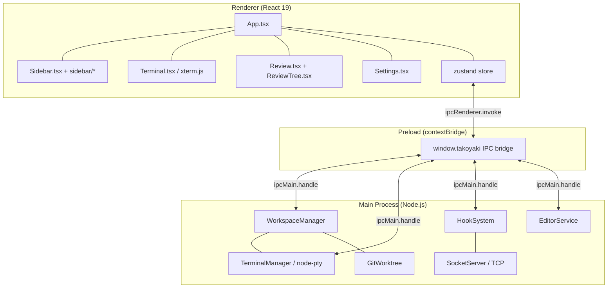

## Pane tree

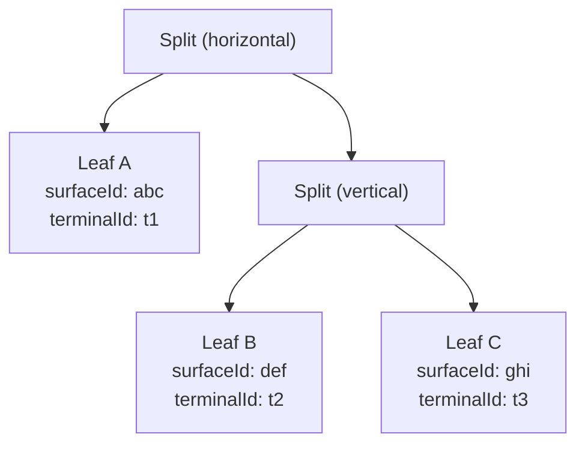

Renders as:

```
┌──────────────┬──────────────┐
│              │     B        │
│     A        ├──────────────┤
│              │     C        │
└──────────────┴──────────────┘
```

Desktop pane focus mode isolates one surface without unmounting the underlying split tree, so resized panel ratios survive when focus mode is toggled off.

## State snapshot flow

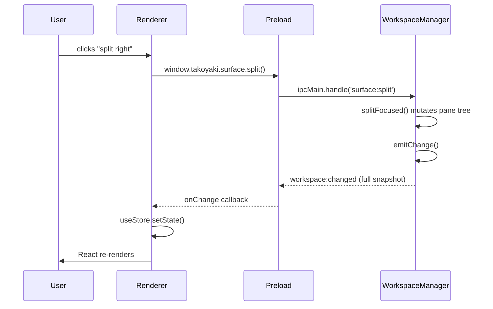

## Hook status flow

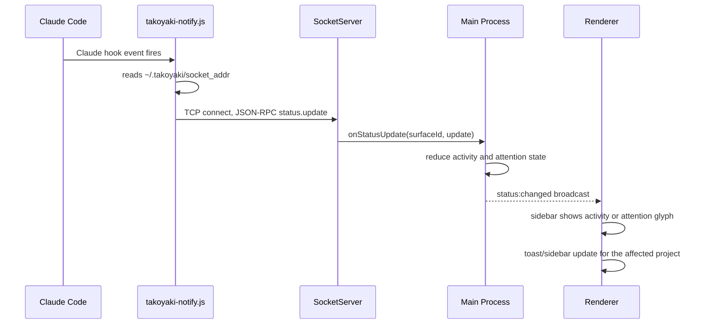

## Terminal data flow

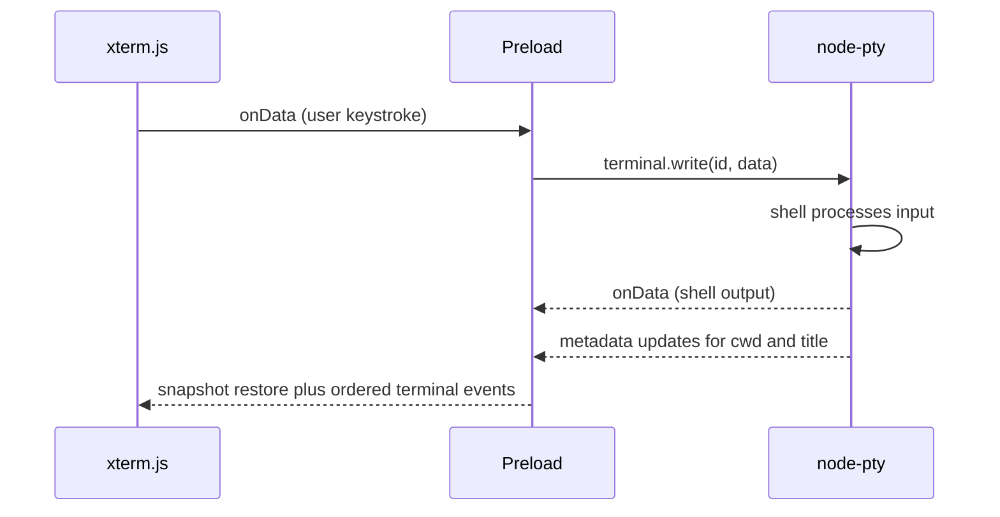

## Task / worktree model

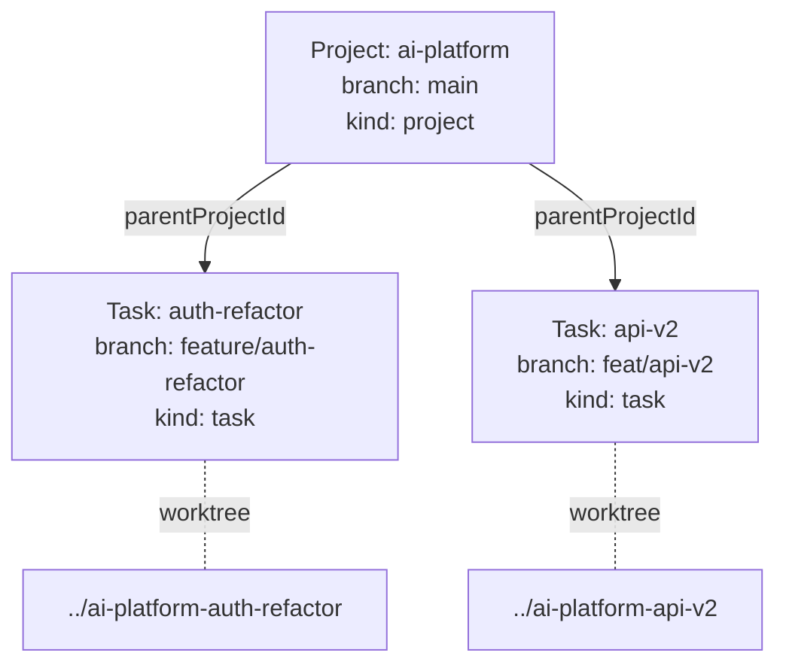

## Theme system

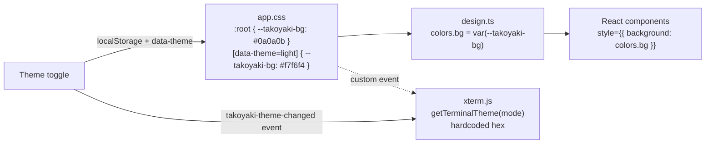

## IPC bridge surface

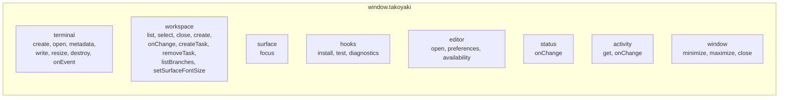

## Review navigation

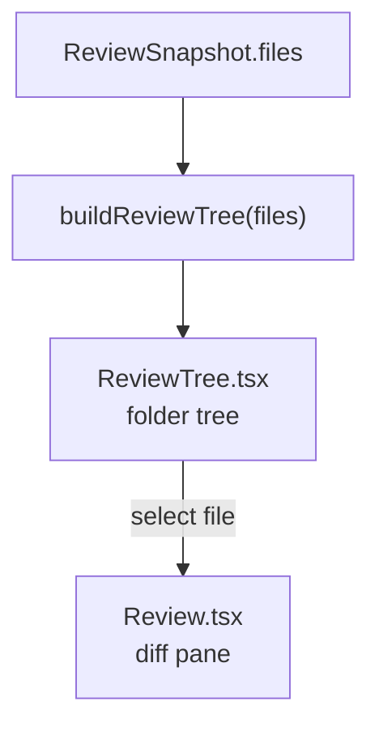

## Storage locations

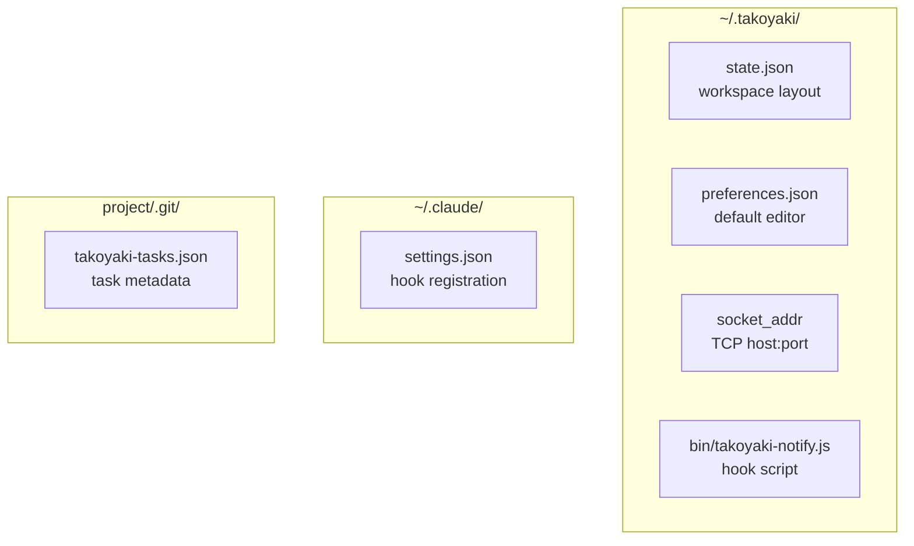

## Security boundaries

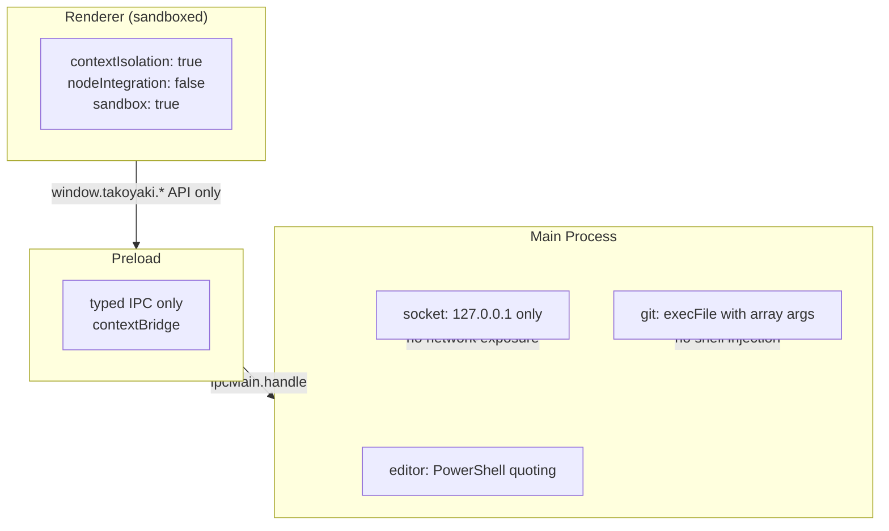
